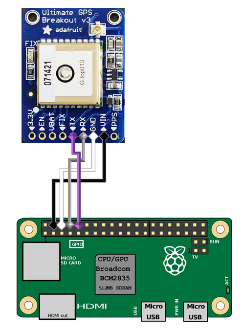

[](https://results.pre-commit.ci/latest/github/theendlessriver13/gpslog/master)
[](https://github.com/theendlessriver13/gpslog/actions?query=workflow%3Abuild)

# gpslog

A tool to track your travel route using the adafruit gps and a raspberry pi.

## Installation

1. clone the repo or download a release
1. `cd` into the dir and run `pip install .`

## Connect the gps to the pi



## start the logger

- run `gpslog /home/pi/my_csv.csv &`

## stop the logger

- run `stop-gpslog`

### Arguments

```console
positional arguments:
  output                define the outputfile (csv)

optional arguments:
  -h, --help            show this help message and exit
  -V, --version         show program's version number and exit
  -i INTERVAL, --interval INTERVAL
                        set the logging interval in seconds
  -v, --verbose         print readings to stdout
```
